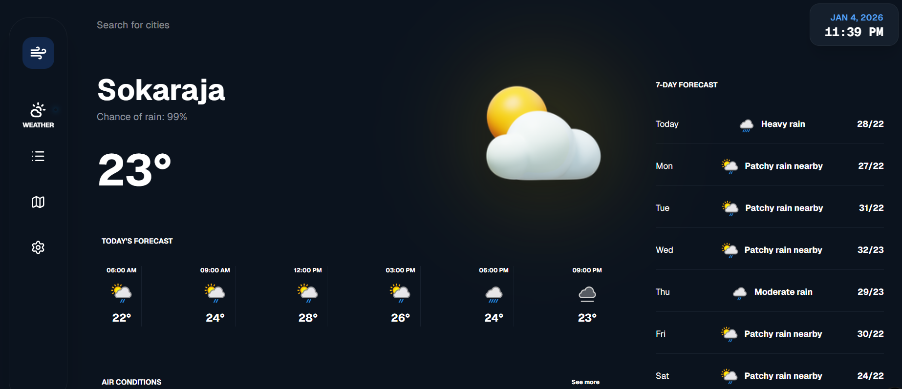

# 🌦️ Modern Bento Weather App



Aplikasi cuaca modern dan responsif yang dibangun menggunakan **Next.js 14 (App Router)** dan **Tailwind CSS**.

Proyek ini mengimplementasikan desain **Bento Grid** yang sedang tren, menampilkan data cuaca real-time dari API, dan menggunakan logika dinamis untuk mengubah ikon cuaca 3D berdasarkan kondisi aktual.

## ✨ Fitur Utama

* **Layout Bento Grid:** Desain antarmuka yang bersih, modern, dan terorganisir dalam bentuk kotak-kotak.
* **Pencarian Kota Real-time:** Mencari data cuaca untuk kota mana pun di dunia menggunakan search bar interaktif.
* **Data Dinamis:** Terintegrasi langsung dengan [WeatherAPI.com](https://www.weatherapi.com/) untuk data yang akurat.
* **Ikon 3D Dinamis:** Ikon cuaca utama (Hero Section) berubah secara otomatis (Hujan, Cerah, Berawan, Badai, dll) berdasarkan kondisi data API.
* **Forecast Detail:**
    * Cuaca saat ini (Suhu, Peluang hujan).
    * Prakiraan per jam (Hourly forecast) pada waktu-waktu kunci.
    * Prakiraan 7 hari ke depan (Weekly forecast).
* **Detail Kondisi Udara:** Menampilkan Real Feel, Kecepatan Angin, UV Index, dan Peluang Hujan.
* **Dark Mode UI:** Tema gelap yang nyaman di mata dengan aksen warna modern.

## 🛠️ Tech Stack

* **Framework:** [Next.js 14](https://nextjs.org/) (App Router)
* **Language:** [TypeScript](https://www.typescriptlang.org/)
* **Styling:** [Tailwind CSS](https://tailwindcss.com/)
* **Data Fetching:** React Hooks (`useState`, `useEffect`) + Fetch API
* **API Provider:** [WeatherAPI.com](https://www.weatherapi.com/)
* **Icons:** [Lucide React](https://lucide.dev/) & Custom 3D PNG Assets
* **Package Manager:** pnpm

---

## 🚀 Cara Menjalankan Project (Getting Started)

Ikuti langkah-langkah ini untuk menjalankan proyek di komputer lokal Anda.

### Prasyarat

Pastikan Anda telah menginstal **Node.js** (versi 18.17.0 atau lebih baru) dan **pnpm**.

### 1. Clone Repository

```bash
git clone [https://github.com/riskyyiman/wheather-app.git](https://github.com/riskyyiman/wheather-app.git)
cd wheather-app
